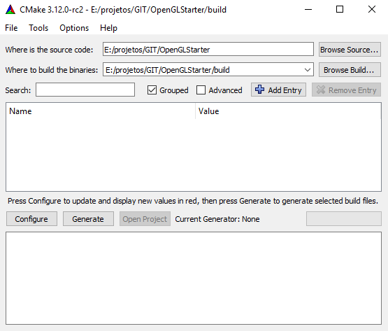
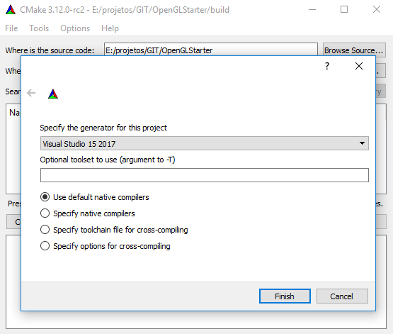
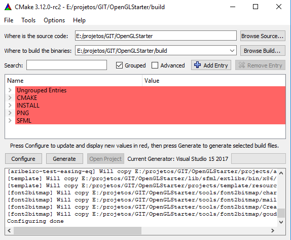
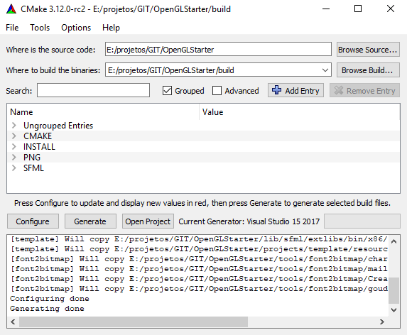

# OpenGLStarter

[Back to HOME](index.md)

## How To Build

After several years programming, I used to use the makefile system. When you use it, you need to create one project build configuration file for each platform you want to compile the project (Operation System: Windows, Linux, Mac, ...).

After a project I participated in the company I worked, one programmer show us the CMake build system.

When you use CMake, you put the files of your software in the configuration files and at the end, it doesn't compile the project. The CMake creates the native platform project files from the configuration files.

With CMake you can create, from the same source, the Windows Visual Studio project, the Linux Makefile project or the MacOS XCode project.

It makes the cross-platform compilation very easy.

### Step-by-Step

1. __Install CMake__ 
Download and install the CMake from their website [here](https://cmake.org/download/).

2. __Setup the source folder and the build folder__  
Open CMake. You will see two input boxes.  
The first you will put the OpenGLStarter folder.  
The Second you will put the location you want to build the project.  
Look at the example:  

3. __Select the platform specific project you want to create__  
When you click in the _configure_ for the first time, you need to select the IDE or the build system you want CMake to generate for you.  

4. __Click in configure until all the red parameters gone__  
CMake analyses your system for the compiler and build system you selected. You need to click several times in the _configure_ button until all red parameters gone.  

5. __Click in generate__  
After these steps, you can open in the IDE you created the project located in the build folder.  

